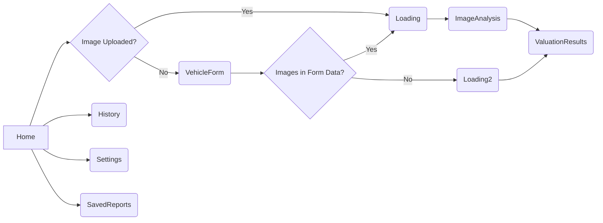

# Plan: Update App Logic for Image Handling

## Description

This plan outlines the steps to update the app logic for handling image uploads and navigation based on the following requirements:

*   If an image is uploaded directly, navigate to `Loading` -> `ImageAnalysis` -> `ValuationResults`.
*   If the vehicle form is submitted with images, navigate to `Loading` -> `ImageAnalysis` -> `ValuationResults`.
*   If the vehicle form is submitted without images, navigate to `Loading2` -> `ValuationResults`.

## Page Flow Diagram

## Task List

1.  **Analyze `Home.jsx`:**
    *   \[ \] Review the existing `handleImageUpload` and `handleFormSubmit` functions.
    *   \[ \] Identify the logic for navigating to the `Loading` component.
2.  **Modify `handleFormSubmit` in `Home.jsx`:**
    *   \[ \] Add a check to see if `uploadedImages` or the form data contains images.
    *   \[ \] If images are present, navigate to the `Loading` component with the appropriate data.
    *   \[ \] If no images are present, navigate to the `Loading2` component with the form data.
3.  **Update Navigation in `App.js`:**
    *   \[ \] Ensure the `Loading` component navigates to `ImageAnalysis` and then `ValuationResults`.
    *   \[ \] Ensure the `Loading2` component navigates directly to `ValuationResults`.
4.  **Testing:**
    *   \[ \] Test the image upload flow to ensure it navigates to `Loading` -> `ImageAnalysis` -> `ValuationResults`.
    *   \[ \] Test the vehicle form submission with images to ensure it navigates to `Loading` -> `ImageAnalysis` -> `ValuationResults`.
    *   \[ \] Test the vehicle form submission without images to ensure it navigates to `Loading2` -> `ValuationResults`.
5.  **Documentation:**
    *   \[ \] Update any relevant documentation to reflect the changes in app logic.